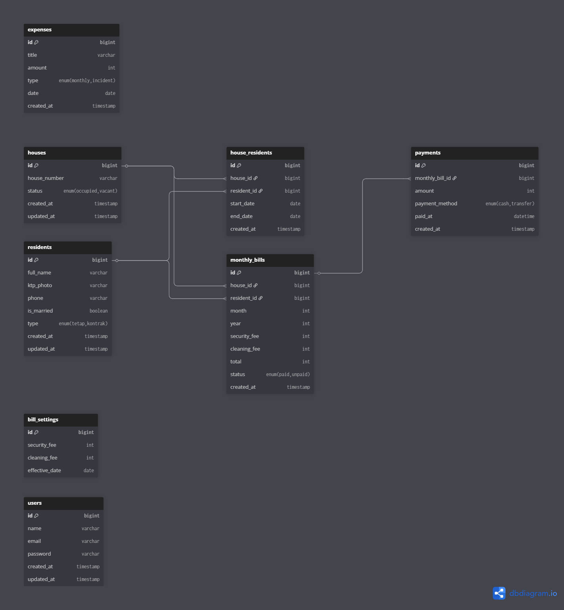
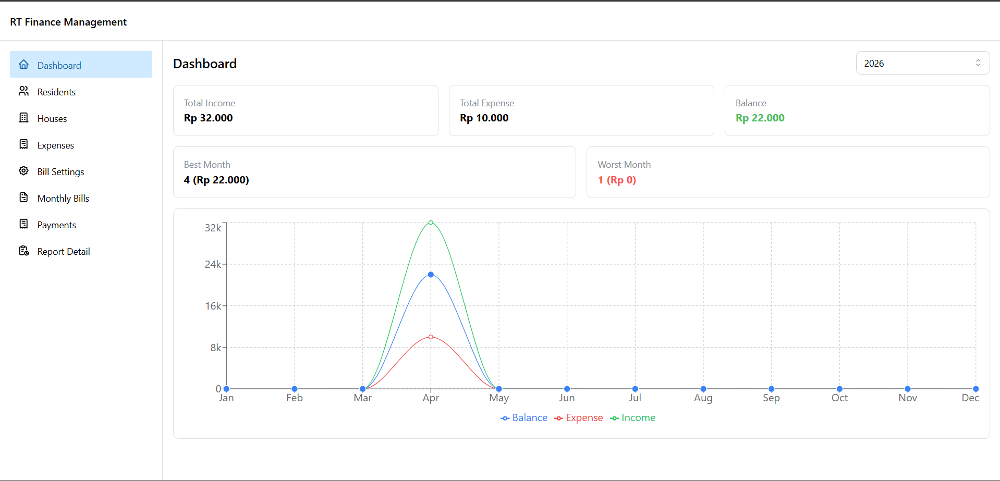
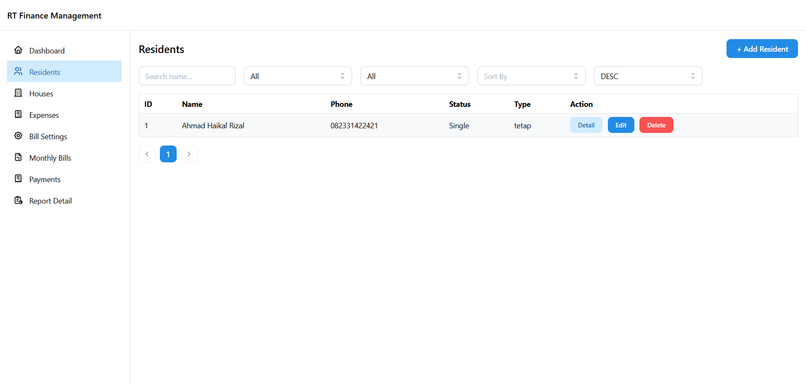
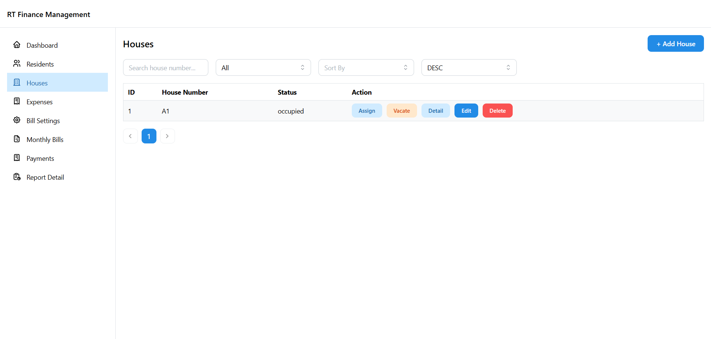
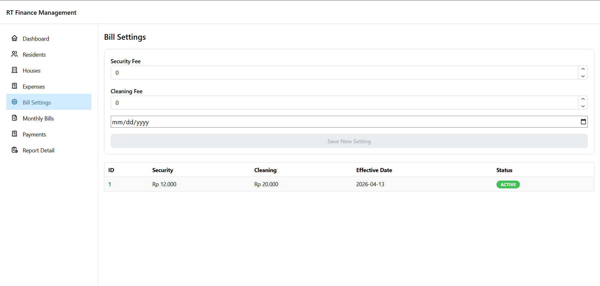
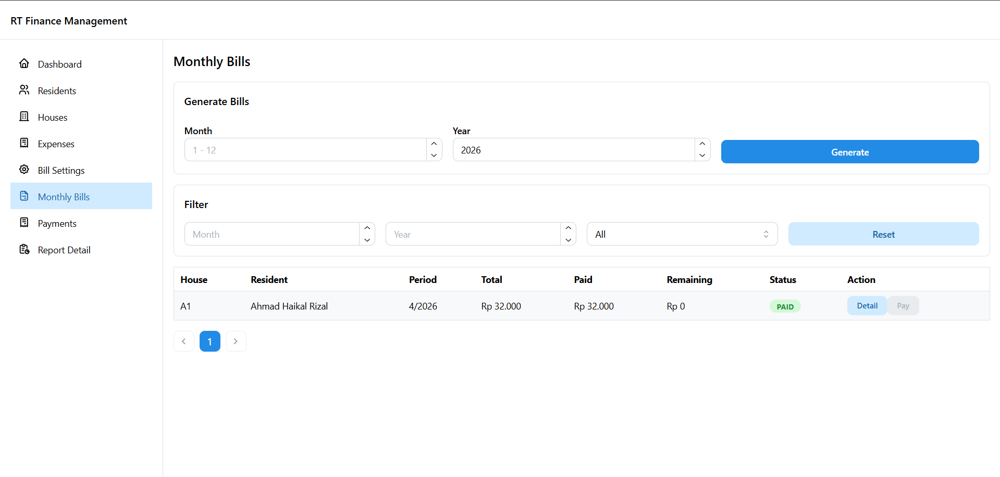
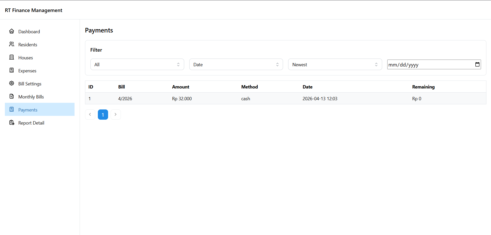
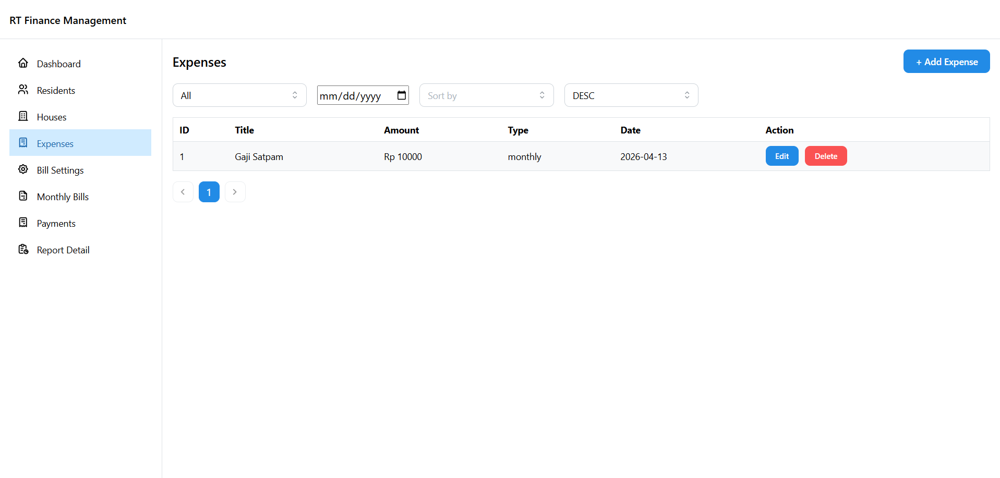
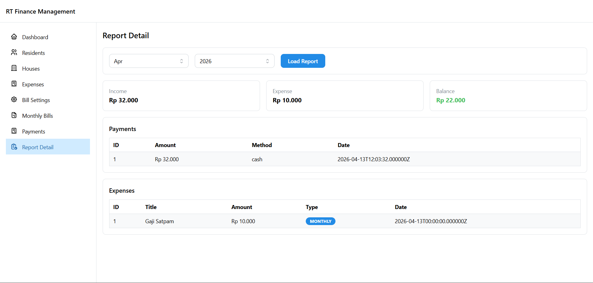

# RT Finance Management

Aplikasi website ini dibuat untuk membantu pengelolaan administrasi keuangan RT, meliputi pengelolaan penghuni, rumah, iuran bulanan, pembayaran, serta laporan keuangan.

---

## Tech Stack

### Backend

- Laravel (PHP ^8.3)
- MySQL

### Frontend

- React.js
- Vite

---

## Installation Guide

### 1. Clone Repository

```bash
git clone rt-finance-management
cd rt-finance-management
```

---

### 2. Backend Setup

```bash
cd backend
composer install
cp .env.example .env
php artisan key:generate
```

#### Setup Database

Edit file `.env`

```
DB_CONNECTION=mysql
DB_HOST=127.0.0.1
DB_PORT=3306
DB_DATABASE=rt-finance-management
DB_USERNAME=root
DB_PASSWORD=
```

```bash
php artisan migrate
php artisan serve
```

Backend URL:

```
http://localhost:8000
```

---

### 3. Frontend Setup

```bash
cd frontend
npm install
npm run dev
```

Frontend URL:

```
http://localhost:5173
```

---

## API Base URL

```
http://localhost:8000/api/v1
```

---

## System Features & Flow

### 1. Bill Settings

Digunakan untuk mengatur nominal iuran:

- Iuran Satpam
- Iuran Kebersihan
- Effective date

Sistem akan menggunakan setting aktif terbaru saat generate tagihan.

---

### 2. Residents

Mengelola data penghuni:

- Nama
- Nomor telepon
- Status (Tetap / Kontrak)
- Status pernikahan

---

### 3. Houses

Mengelola data rumah:

- Nomor rumah
- Status: occupied / vacant

Action:

- Assign → Mengisi rumah dengan penghuni
- Vacate → Mengosongkan rumah

---

### 4. Monthly Bills

Generate tagihan bulanan berdasarkan:

- Rumah yang memiliki penghuni
- Bill settings aktif

Perhitungan:

```
Total = Security Fee + Cleaning Fee
```

---

### 5. Payments

Mencatat pembayaran:

- Bill
- Amount
- Method
- Date

Status pembayaran ditentukan berdasarkan total pembayaran terhadap tagihan.

---

### 6. Expenses

Mengelola pengeluaran RT:

- Pengeluaran bulanan (contoh: gaji satpam)
- Pengeluaran insidental (contoh: perbaikan jalan)

---

### 7. Dashboard

Menampilkan ringkasan:

- Total income
- Total expense
- Balance
- Statistik bulanan dalam bentuk grafik

---

### 8. Report Detail

Laporan berdasarkan bulan dan tahun:

- Total income
- Total expense
- Balance
- Detail pembayaran
- Detail pengeluaran

---

## Business Flow

```
1. Set Bill Settings
2. Input Residents
3. Input Houses
4. Assign Residents to Houses
5. Generate Monthly Bills
6. Record Payments
7. Input Expenses
8. View Dashboard and Reports
```

---

## ERD (Entity Relationship Diagram)

Berikut adalah desain database:



---

## Notes

- Hanya rumah dengan penghuni yang akan ditagih
- Pembayaran dapat dilakukan langsung (pembayaran penuh/mencicil)
- Sistem mendukung pengeluaran bulanan dan insidental

---

## Future Improvements

- Partial payment (cicilan)
- Upload bukti pembayaran
- Notifikasi tagihan
- Export laporan (PDF/Excel)
- Role management

---

## Screenshots

### Dashboard



### Residents



### Houses



### Bill Settings



### Monthly Bills



### Payments



### Expenses



### Report Detail



---

## Author

Ahmad Haikal Rizal

```

```
